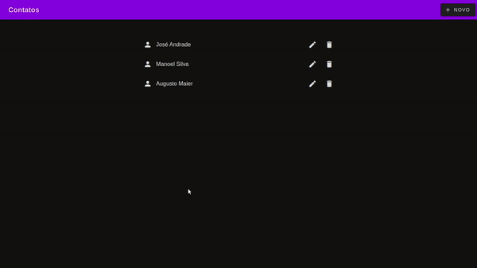

<h1 align="center">Contact List</h1>

<h2 align="center">
  
</h2>

<h3 align="center">
  <a href="https://contaclist-vue.netlify.app/">Acessar Demonstração</a>
</h3>

## Sobre o projeto
**Contact List** é uma aplicação web desenvolvida com **Vue.js + Material Design** que consome uma [**API REST**](https://api.mocki.io/v1/a2790e8c) e salva esses dados em banco de dados local.

Desenvolvida para solucionar o desafio técnico para o cargo de Frontend Developer.

---

## Tecnologias utilizadas

- [Vue.js](https://vuejs.org/)
- [Material Design (web)](https://material.io/develop/web)


Foram utilizados os links CDNs do [**Material Design**](https://material.io/develop/web/docs/getting-started) para agilizar o desenvolvimento.

---

## Como baixar e rodar o projeto

```bash

  # Clonar repositório
  $ git clone https://github.com/renanbrenovital/contact-list.git

  # Entrar no diretório
  $ cd contact-list

  # Instalar dependências
  $ yarn install

  # Iniciar o projeto
  $ yarn serve

  # Acessar o localhost
  $ http://localhost:8080/

```

---

## Sobre o Autor

Olá, me chamo **Renan Vital**.

Sou desenvolvedor **Fullstack Javascript** (com muitos anos de estrada no mundo da programação rs). Meu foco hoje é na parte visual de aplicações web e mobile (**UI e Frontend**) bem como na experiência do usuário (**UX**).

Sou um cara tranquilo, família e grato à Deus por por tudo que sou e tenho. Apaixonado por futebol, tecnologia e ávido por conhecimento!
